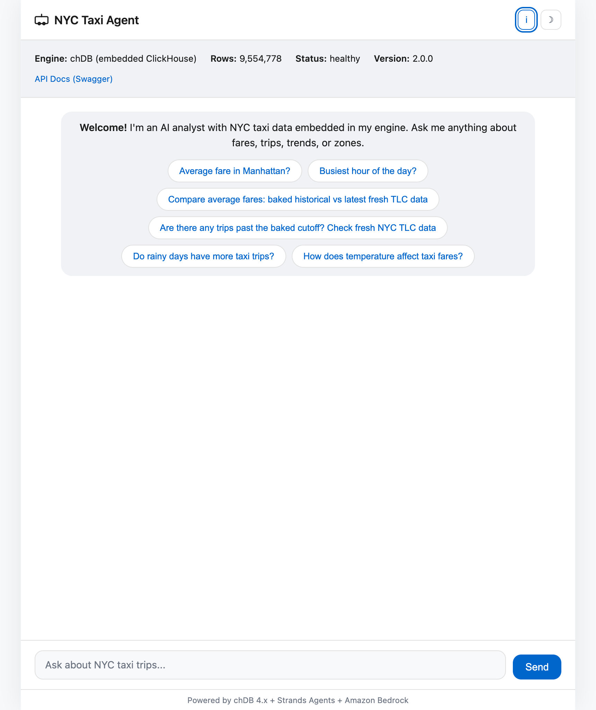
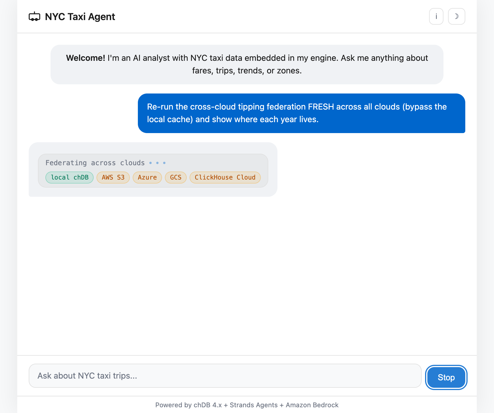
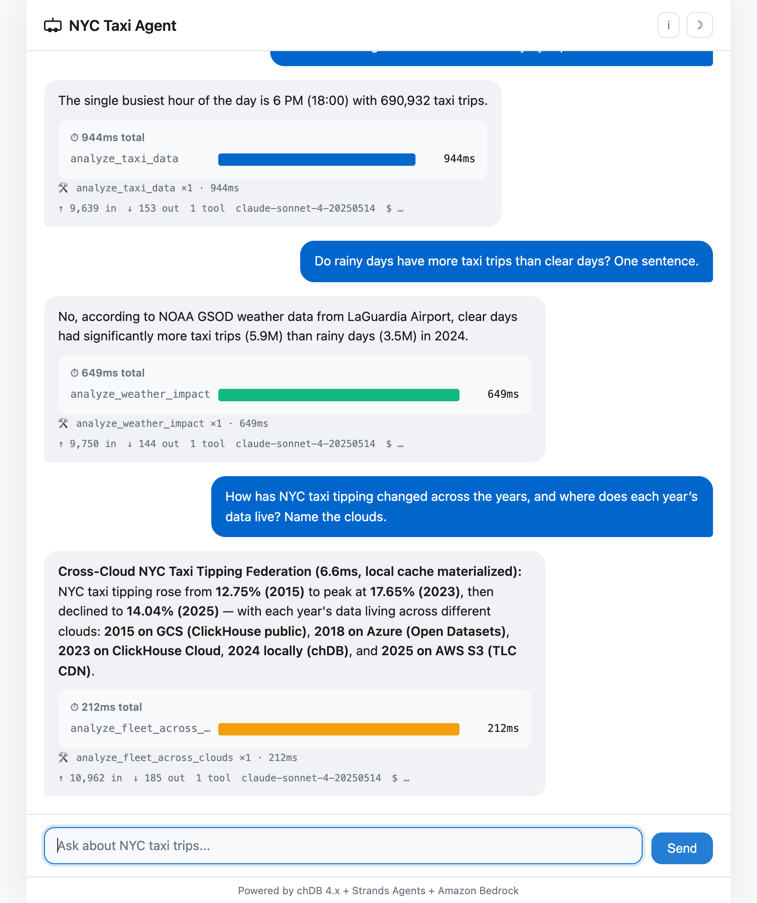
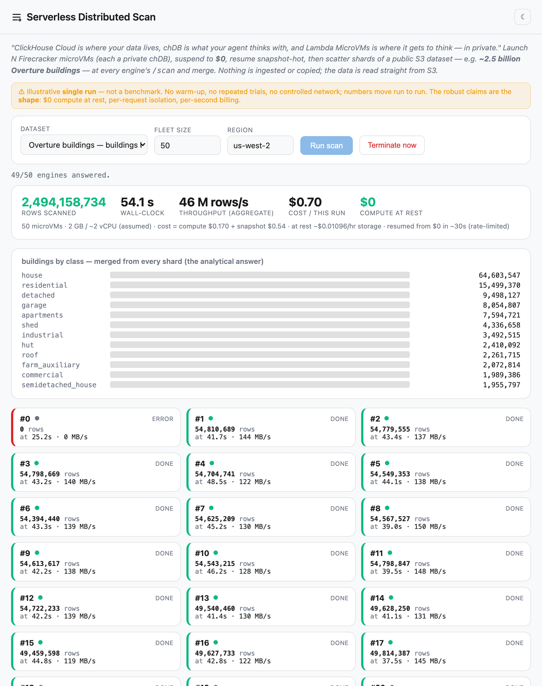
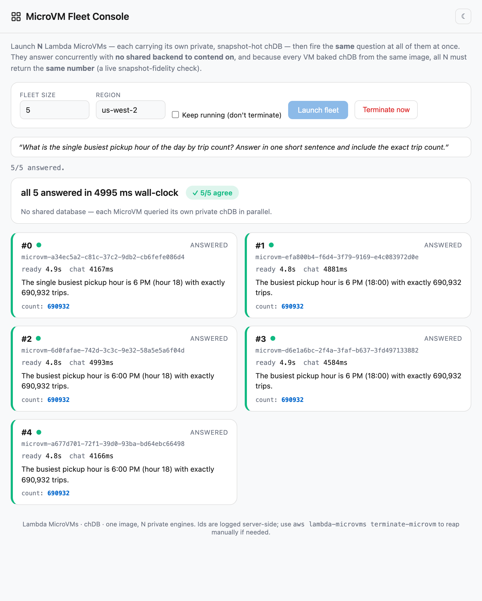
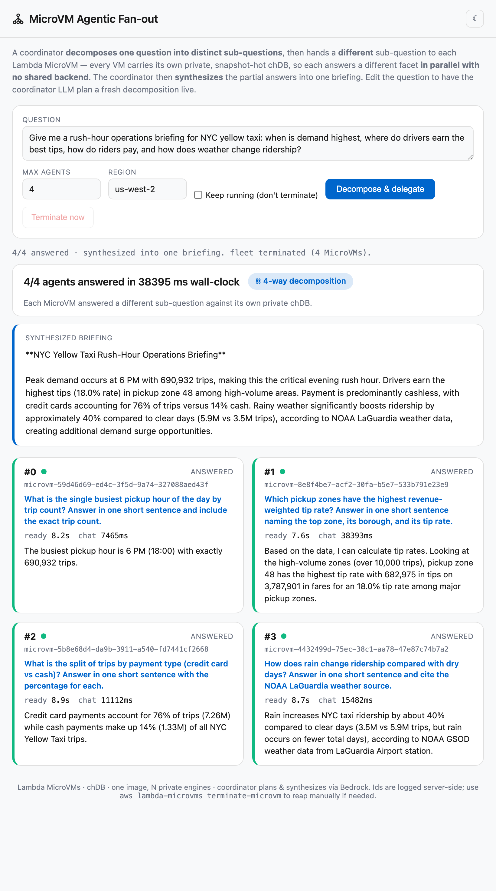

# NYC Taxi Analytics Agent

A streaming, natural-language analytics agent over NYC Yellow Taxi data that **carries its
own query engine**. Instead of reaching across a network to a warehouse on every step, the
agent embeds [chDB](https://github.com/chdb-io/chdb) (in-process ClickHouse) and thinks
*with* its data — local memory, cross-source federation, and sub-millisecond recall, all
inside the agent's own process.

It is a reference implementation of the idea that **the data layer should travel with the
agent**, and a worked example of running that pattern on
[AWS Lambda MicroVMs](https://aws.amazon.com/lambda/lambda-microvms/) — where every MicroVM
carries its own private, snapshot-hot chDB engine, billed only while it runs. chDB is a
launch partner for Lambda MicroVMs; this repo shows why the two fit together.

> **TL;DR** — ask questions like *"do rainy days have more trips?"* and the agent answers
> with one ClickHouse SQL statement run in-process against a baked local store, reaching out
> to remote sources (AWS S3, PostgreSQL, ClickHouse Cloud) only when a question needs them —
> no connection pools, no warehouse to overload.

---

## See it in action

The single-file chat UI streams every answer, shows **which tool ran and how long it took**
(coloured by data plane — blue = in-process chDB, green = S3, amber = cross-cloud), turns
**Send** into **Stop** so you can cancel a slow query, and — for the federation tool — lights
up **every cloud the one SQL statement reaches**. The shots below are that UI driven live
against the agent running on an **AWS Lambda MicroVM** (9.5M baked rows, via
[`scripts/microvm_ui_proxy.py`](scripts/microvm_ui_proxy.py)):

| The agent, live | One SQL, multi clouds |
|---|---|
|  |  |
| Engine, row count and health read straight from the running MicroVM. | The federation tool reaching **local chDB + AWS S3 + Azure + GCS + ClickHouse Cloud** in a single statement — the **Stop** button cancels a query mid-flight. |



*Every answer carries a per-tool latency waterfall. Here: the in-process baked query (blue)
returns in under a second, the NOAA-weather S3 join (green) in ~0.6s, and the decade-long
cross-cloud tipping federation (amber) — served from its materialized local cache after the
first reach — in milliseconds. **"Federate to reach, localize to think."***

---

## Why in-process data

An agent is a loop: plan → call a tool → read the result → reason → repeat, often 5–20 tool
calls per turn, and most of those calls are data access. When that data lives across a
network, two things happen:

- **Latency compounds.** Ten sequential round-trips of dead air are felt as "the agent is slow."
- **Instability becomes a token cost.** A flaky call triggers a retry — and in an agent loop a
  retry re-sends the whole context window, then a detour. The cost shows up on the bill.

chDB attacks both at the root by putting a full ClickHouse query engine *inside the agent's
process*. This project demonstrates that across three pillars:

1. **Local agent memory** — append-only, time-travelling memory in chDB (`chdb_memory.py`).
2. **A federation hub** — chDB can join the local store with remote sources (AWS S3,
   PostgreSQL, ClickHouse Cloud) in a single declarative SQL statement (`federation_tools.py`).
3. **Stability & cost** — the hot path is a function call, not a network request, so it is
   fast and deterministic.

On **Lambda MicroVMs** all three land in the cloud at once: a Firecracker-isolated VM with a
private chDB, hot from the first millisecond (memory snapshot), suspended when idle (no
charge), and resumed with state intact.

## What it can answer

| Question | Tool | Data path |
|---|---|---|
| "Average fare in Manhattan?" / "Busiest hour?" | `analyze_taxi_data` | baked local chDB store |
| "How many trips in a month past the baked data?" | `query_with_fresh_data` | baked store + live CDN delta (when the public TLC CDN serves that month) |
| "Do rainy days have more trips than clear days?" | `analyze_weather_impact` | NOAA GSOD (S3 Files mount or `s3()`) |
| "How has tipping changed over the decade?" | `analyze_fleet_across_clouds` | one SQL spanning the local store + remote sources |
| "Which pickup zones tip best?" | `analyze_zone_tipping` | local chDB JOIN a PostgreSQL zone lookup |

The federation tool reads from remote sources, then **materializes the result into the local
chDB store** so the next identical question is served in milliseconds — *federate to reach,
localize to think*. Sources are an allow-list vetted in
[`cloud_sources.py`](cloud_sources.py); the model never supplies a URL or a credential, and
any credentials the generated SQL must carry (e.g. `postgresql()` / `remoteSecure()`) are
redacted before that SQL is returned to the model or a trace. If one cloud is unreachable the
leg is skipped rather than failing the whole query, and the skipped clouds are reported back
in a `sources_unavailable` field.

> Note: `query_with_fresh_data` and the live-delta path depend on the public NYC TLC
> CloudFront CDN. The agent reads it with a browser User-Agent to avoid WAF throttling, but
> the CDN can still return `403`/`404` for some months; the tool degrades gracefully and
> reports the month as unavailable rather than failing. Questions inside the baked data range
> are always served locally.

## Architecture

```
Browser ──HTTP/SSE──▶ FastAPI (main.py) ──▶ Strands Agent (agent.py) ──▶ Amazon Bedrock
                          │                      │                        (Claude Sonnet 4)
                          │                      ├─▶ analyze_taxi_data         ──▶ chDB embedded store
                          │                      ├─▶ query_with_fresh_data     ──▶ chDB + CDN delta
                          │                      ├─▶ analyze_weather_impact    ──▶ NOAA GSOD (mount / s3())
                          │                      ├─▶ analyze_fleet_across_clouds ─▶ chDB federation:
                          │                      │        local store + remote (S3 · ClickHouse Cloud)
                          │                      └─▶ analyze_zone_tipping      ──▶ chDB JOIN postgresql()
                          ├─▶ AgentCore Memory (optional)   ─ cross-session memory
                          └─▶ Langfuse / OTEL  (optional)   ─ traces, token & cost metrics
```

The same application targets three environments (Local and Lambda MicroVMs are the
actively validated paths; AgentCore Runtime is also supported via the deploy script + CDK):

| Target | How | Notes |
|---|---|---|
| **Local** | `uvicorn main:app` | embedded chDB; fastest dev loop |
| **AWS Lambda MicroVMs** | `microvm_entrypoint.py` + `Dockerfile.microvm` | snapshot-hot chDB, suspend/resume, public egress (no VPC/NAT) |
| **AWS Bedrock AgentCore Runtime** | `scripts/create_runtime.py` + CDK | also supported — managed Firecracker runtime + AgentCore Memory (heavier: VPC/NAT/CDK) |

## Running on AWS Lambda MicroVMs

Lambda MicroVMs fuse Firecracker isolation, snapshot-based fast starts, and suspend/resume
with state preserved. This app exploits all three via the **lifecycle-hook contract**: the
hooks server ([`microvm_hooks.py`](microvm_hooks.py)) runs alongside the app
([`microvm_entrypoint.py`](microvm_entrypoint.py)) in one process so that `/ready` warms the
chDB store *before* the platform snapshots the VM — the first query is then served hot, with
no engine init and no store load. Egress is public by default, so there is **no VPC and no
NAT gateway** to provision.

```bash
# Requires AWS CLI >= 2.35.12 (the version that ships the `lambda-microvms` service)
python scripts/deploy_microvm.py --dry-run          # print every AWS call, change nothing
python scripts/deploy_microvm.py --region us-west-2  # build the image, run a MicroVM, verify
python scripts/deploy_microvm.py --terminate-only    # tear down
```

The deploy is account-agnostic and idempotent: it derives every resource from the caller
identity, creates a private S3 artifact bucket and two least-privilege IAM roles, packages
the app (a secret guard refuses to ship any `.env*` except `.env.example`), builds the
MicroVM image with lifecycle hooks, runs a MicroVM, and verifies `/ping → /health → /chat`
over the dedicated HTTPS endpoint.

## Serverless distributed scan — a ClickHouse workload with no cluster

> *"ClickHouse Cloud is where your data lives, chDB is what your agent thinks with, and
> Lambda MicroVMs is where it gets to think — in private."*

The same architecture that gives one agent a private engine scales sideways into an
**ephemeral, shared-nothing distributed query engine**: launch N Firecracker microVMs — each a
private chDB — suspend the fleet to **$0**, resume it snapshot-hot, then **scatter** shards of a
huge dataset at each VM's `/scan`, and **gather** the mergeable partials. The nodes don't exist
until the query arrives and are gone seconds later, billed per second — no cluster, no ingestion.
The headline dataset is **Overture Maps buildings — ~2.5 billion rows**, read straight from
[its public S3 bucket](https://registry.opendata.aws/overture/) in-region: **nothing is copied
or staged.** (The dataset picker also offers the global road network, or a private lake of your own.)

**This is not a race against ClickHouse Cloud.** On raw throughput a warehouse wins; this is
the shape Cloud *can't* be — per-request-isolated, **$0 compute at rest**, spun up on demand.
Use Cloud when data is persistent, shared, and always-on; use chDB-on-MicroVMs when compute is
**bursty, per-tenant-isolated, and should cost nothing at rest**. One query plane, two runtimes.



*One run in the live console (`scripts/scan_console.py`): 50 private chDB engines scanned
**2,494,158,734 Overture buildings in ~54 s for $0.70**, cluster at **$0 at rest** — with the
"not a benchmark" disclaimer up top, the merged building-type answer, and each engine's ~140 MB/s.
The `#0 ERROR` card is a straggler — expected in any single run; the answer merges the other 49.*

To make it tangible, here's roughly what one run looked like on AWS (`us-west-2`, image config
2 GB RAM; ~2 vCPU assumed — the API doesn't expose the vCPU allocation). **Treat these as
illustrative, order-of-magnitude figures — not a benchmark:** single-shot, no warm-up, no repeated
trials, no controlled network; they move run to run.

| Dataset | Rows | Fleet | Wall-clock | Throughput | Cost / run | At rest |
|---|---|---|---|---|---|---|
| **Overture buildings** (public S3) | ~2.5 B | 50 microVMs | ~54 s | ~46 M rows/s | ~$0.70 | **$0 compute** |
| Overture road network (public S3) | ~0.3 B | 30 microVMs | ~10 s | ~30 M rows/s | ~$0.30 | **$0 compute** |
| private NYC-taxi lake | ~0.8 B | 50 microVMs | ~8 s | ~100 M rows/s | ~$0.55 | **$0 compute** |

The point isn't the exact figure — it's the **shape**: **~2.5 billion buildings scanned by 50
ephemeral Firecracker chDB engines in under a minute, for ~70 cents**, with the cluster at **$0
compute when idle** (only ~$0.01/hr of snapshot storage). Per-run cost is dominated by snapshot
resume/suspend; compute is a few cents. The claims that *are* robust — not run-dependent — are
the economics (**$0 at rest, per-second billing**), the **per-request Firecracker isolation**, and
reading **S3 directly with no ingestion**. And the merged answer is a real analytical result — the
global building-type mix (house ≫ residential ≫ detached ≫ garage ≫ apartments ≫ …).

What a rigorous benchmark would add — and we deliberately haven't — is warm-up passes, repeated
trials with p50/p95, a pinned vCPU/memory shape, and a controlled network. So rather than trust a
table, the console above runs it live. Two honest scaling notes it makes visible: throughput
scales **sub-linearly** (per-VM S3 setup dominates small shards), and fleet resume is
**rate-limited** (`ResumeMicrovm` ~5/s) — waking a large fleet from $0 takes tens of seconds, not
milliseconds.

Reproduce it (needs the deployed image; the Overture data is public, so there's nothing to stage):

```bash
python scripts/scan_console.py --region us-west-2                              # live console → http://localhost:8080
python scripts/scan_demo.py --dataset buildings --count 50 --region us-west-2  # headless: prints the run's metrics
python scripts/scan_demo.py --dataset segments  --count 30 --region us-west-2  # the global road network instead
python scripts/stage_lake.py --region us-west-2   # optional: stage a private NYC-taxi lake, then --dataset taxi
```

Both the console and the CLI share one tested core ([`fleet_core.py`](fleet_core.py)); the worker
is a raw, LLM-free `/scan` endpoint ([`scan_tools.py`](scan_tools.py)) that reads public datasets
anonymously and private ones with the microVM's own least-privilege role (creds via IMDS, never in
the SQL), building every S3 URL from a vetted registry — no arbitrary URL or bucket crosses the wire.

## Demos

Each demo backs a specific claim. The first set needs only `pip install`; the rest need AWS
(and, for graduation, a ClickHouse Cloud service).

**Local, no cloud:**

```bash
# Snapshot-boot + suspend/resume fidelity, with the real lifecycle hooks and chDB,
# emulated by killing and restarting the process on a persistent store:
python scripts/microvm_local_lifecycle.py --synthetic

# chDB-native agent memory: remember -> recall -> revise as history, plus a
# point-in-time "what did the agent believe before I corrected it?" query:
python scripts/chdb_memory_demo.py
```

**On AWS:**

- **Drive the deployed MicroVM from your browser** — serve the chat UI locally and proxy every
  request (real SSE passthrough) to a running MicroVM, so the browser talks to the AWS agent.
  This is how the [screenshots above](#see-it-in-action) were captured:
  ```bash
  # ids come from what scripts/deploy_microvm.py printed
  python scripts/microvm_ui_proxy.py \
    --microvm-id microvm-xxxx --endpoint xxxx.lambda-microvm.us-west-2.on.aws --region us-west-2
  # then open http://localhost:8080
  ```
- **Snapshot-hot start** — the first analytical query after `RunMicrovm` is warm because
  `/ready` gated the snapshot on chDB being loaded (`scripts/deploy_microvm.py` verify step).
- **The agent brain that suspends and resumes** — federate a decade of tipping (materialized
  into the local chDB store), `suspend-microvm` (no charge), then `resume-microvm` and get the
  same answer from the on-disk cache in milliseconds.
- **Fleet fan-out** — N MicroVMs, each with its own private chDB, answering the same question
  concurrently (no shared database to overload). Because every VM baked chDB from the *same*
  image, all N return the *same* number — a live **consensus / snapshot-fidelity** check:
  ```bash
  # headless (prints a table): fleet size, ready-time, latency, answer, consensus
  python scripts/microvm_fleet_demo.py --count 5 --region us-west-2

  # OR a live browser view of the same fan-out — a grid of cards updating in real time,
  # with a wall-clock headline and a consensus badge (open http://localhost:8080):
  python scripts/fleet_console.py --region us-west-2
  ```
  

  All 5 answered in the wall-clock time of a *single* answer (they ran in parallel with nothing
  to contend on), and all five private chDB stores returned the identical `690932` — **5/5 agree**.
  Both front-ends share one tested core ([`fleet_core.py`](fleet_core.py)); the console
  orchestrates the fleet server-side (auth tokens never reach the browser) and *always* tears the
  fleet down when the run ends.
- **Agentic fan-out** — the same fleet, but instead of *one* question at every VM, a coordinator
  **decomposes one high-level question into distinct sub-questions** and hands a *different* one to
  each MicroVM's agent. Every VM holds the same complete private chDB, so each answers a different
  facet (busiest hour / best-tipping zone / payment mix / weather impact) in parallel — then the
  coordinator **synthesizes** the partial answers into one briefing. This is map-reduce over the
  *question* (versus consensus, which splits nothing, and the distributed scan, which splits the
  *data*):
  ```bash
  # live browser view: one card per sub-question, then a synthesized briefing (open http://localhost:8080)
  python scripts/agentic_console.py --region us-west-2
  ```
  

  *One live run:* the coordinator split the briefing into four sub-questions and fanned one at each
  MicroVM — busiest hour (**6 PM, 690,932 trips**), best-tipping zone (**zone 48, 18.0%**), payment
  mix (**76% card / 14% cash**), and rain's effect on ridership (**~40% more, per NOAA LaGuardia**) —
  all answered **concurrently in 38 s wall-clock** against four *independent* private chDB engines,
  then folded into a single briefing. The default question uses a curated, always-green
  decomposition; **edit the question** and the coordinator LLM (Bedrock) plans a fresh decomposition
  live, with a safe fallback to fanning the raw question if planning fails. Same tested core
  ([`fleet_core.py`](fleet_core.py)), server-side orchestration (auth tokens never reach the
  browser), and guaranteed teardown as the consensus console.
- **Zero-refactor graduation to ClickHouse Cloud** — the *same* analytical SQL served from a
  local chDB table, then from ClickHouse Cloud via `remoteSecure()` — only the view's source
  changes:
  ```bash
  python scripts/graduation_demo.py --db-path ./local_chdb_data
  ```

## Quick start (local)

Prerequisites: **Python 3.13**, AWS credentials with **Amazon Bedrock** access to the Claude
Sonnet 4 inference profile (`us.anthropic.claude-sonnet-4-20250514-v1:0`).

```bash
git clone <your-fork-url> nyc-taxi-agent && cd nyc-taxi-agent
python3 -m venv .venv && source .venv/bin/activate
pip install -r requirements.txt -r requirements-dev.txt
cp .env.example .env.local          # fill in AWS creds / region

# Bake a one-month sample (~3M rows, a few seconds) so the agent has data to query.
python scripts/bake_sample.py                       # writes ./local_chdb_data + data_profile.json

# Run the app.
CHDB_DATA_PATH="$PWD/local_chdb_data" uvicorn main:app --host 127.0.0.1 --port 8080
```

Then drive it:

```bash
curl -s localhost:8080/health     # {"status":"healthy","row_count":2964624}
curl -s localhost:8080/chat -H 'Content-Type: application/json' \
  -d '{"text":"What is the busiest hour of the day? One sentence."}'
```

The FastAPI app warms chDB at startup — both the taxi table and the agent-memory tables, so
the first query is served from a fully loaded store with no lazy-load contention. A
single-file chat UI is served at `http://localhost:8080/`; it streams the answer, shows a
per-tool latency waterfall (coloured by data plane), and turns **Send** into **Stop** while a
query is in flight. (Skip the bake and the app starts fine but `/health` reports `unhealthy`
and `/chat` errors until data exists.)

## Claude Code skills

This repo ships **project skills** under [`.claude/skills/`](.claude/skills/) — validated,
end-to-end workflows that [Claude Code](https://claude.com/claude-code) auto-discovers. They
are optional conveniences; everything they do can also be run by hand.

| Skill | What it does |
|---|---|
| `run-local` | Bake a one-month sample and run the app locally for a fast smoke test |
| `run-prod` | Run locally in prod mode with AgentCore Memory provisioned in your account |
| `deploy-microvm` | Package and deploy to **AWS Lambda MicroVMs**, then verify over the endpoint |
| `deploy-agentcore` | Provision CDK infra + AgentCore Memory and register an AgentCore Runtime |
| `deploy-to-prod` | Full AWS deploy plus a local browser UI wired to the deployed runtime |
| `deploy-mount-demo` | EC2 host that NFS-mounts an S3 Files filesystem for the weather `file()` path |

## Configuration

All configuration is via environment variables (see [`.env.example`](.env.example)). Secrets
belong in `.env.local` (git-ignored) or AWS SSM — never commit them.

| Variable | Required | Purpose |
|---|---|---|
| `AWS_ACCESS_KEY_ID` / `AWS_SECRET_ACCESS_KEY` / `AWS_SESSION_TOKEN` | yes | AWS auth for Bedrock (+ optional Memory/S3) |
| `AWS_REGION` | yes | Region for AWS clients |
| `BEDROCK_MODEL_ID` | no (default set) | Bedrock model / inference profile |
| `BEDROCK_REGION` | no | Overrides the Bedrock client region (used on MicroVMs, where `AWS_REGION` is reserved) |
| `CHDB_DATA_PATH` | yes | Path to the baked chDB store |
| `MICROVM_HOOKS_PORT` | no (9000) | Lifecycle-hook port (Lambda MicroVMs) |
| `WEATHER_MOUNT_PATH` | no | S3 Files NFS mount path; falls back to direct `s3()` if absent |
| `CLICKHOUSE_URL` / `CLICKHOUSE_USER` / `CLICKHOUSE_PASSWORD` | no | ClickHouse Cloud federation leg. Falls back to SSM `/clickhouse/*` (region: `CLICKHOUSE_SSM_REGION`) when unset — so a deployed MicroVM reaches the warehouse via its IAM role with no baked secrets. Leg is skipped only if neither yields creds. |
| `POSTGRES_*` | no | PostgreSQL zone-lookup leg for `analyze_zone_tipping` |
| `AGENTCORE_MEMORY_ID` | no | Cross-session AgentCore Memory; agent is stateless without it |
| `LANGFUSE_*` / `OTEL_EXPORTER_OTLP_*` | no | Observability; trace export is disabled when no endpoint is configured |
| `IS_PROD` | no (false) | Toggles prod-only code paths |

## Testing

```bash
pytest -q                 # unit + integration (chDB-backed) tests
pytest -m unit            # fast, isolated unit tests only
pytest -m network         # opt-in tests that reach external clouds
```

Unit and integration tests run from a clean clone with just `pip install`. The cloud demos
(`deploy_microvm.py`, `microvm_fleet_demo.py`, `graduation_demo.py`) require live AWS
credentials and are not part of the offline suite.

## Repository layout

```
main.py                      FastAPI app: /chat, /chat/stream, /health, /ping, /invocations
agent.py                     Strands agent wiring + streaming
chdb_tools.py                analyze_taxi_data          (baked store)
sql_tools.py                 query_with_fresh_data      (baked + CDN delta)
weather_tools.py             analyze_weather_impact     (NOAA GSOD)
federation_tools.py          analyze_fleet_across_clouds + analyze_zone_tipping
cloud_sources.py             vetted federation source allow-list
chdb_memory.py               append-only chDB agent memory with time-travel
db.py / init_db.py           chDB accessors + build-time data bake
memory.py / agent_memory.py  session + cross-session (AgentCore) memory
observability.py             Langfuse / OTEL setup
microvm_hooks.py             reusable Lambda MicroVMs lifecycle-hook server
microvm_runtime.py           taxi-app warm/validate/checkpoint wiring
microvm_entrypoint.py        runs the app (:8080) + hooks (:9000) in one process
Dockerfile / Dockerfile.microvm   container images (AgentCore / MicroVMs)
scripts/                     deploy + demo scripts (see Demos)
cdk/                         AWS CDK stacks (VPC, IAM, ECR, S3 Files, monitoring, CI/CD)
cicd/ · evaluation/          CI factuality gate + evaluation harness
static/index.html            single-file chat UI
tests/                       unit + integration tests
.claude/skills/              Claude Code project skills
```

## Tech stack

Amazon Bedrock (Claude Sonnet 4) · [Strands Agents](https://github.com/strands-agents/sdk-python) ·
[chDB](https://github.com/chdb-io/chdb) 4.1.8 · FastAPI + uvicorn · AWS Lambda MicroVMs /
Bedrock AgentCore · AWS CDK · Langfuse (OTEL) · ClickHouse Cloud.

## License

Licensed under the Apache License, Version 2.0 — see [LICENSE](LICENSE).
